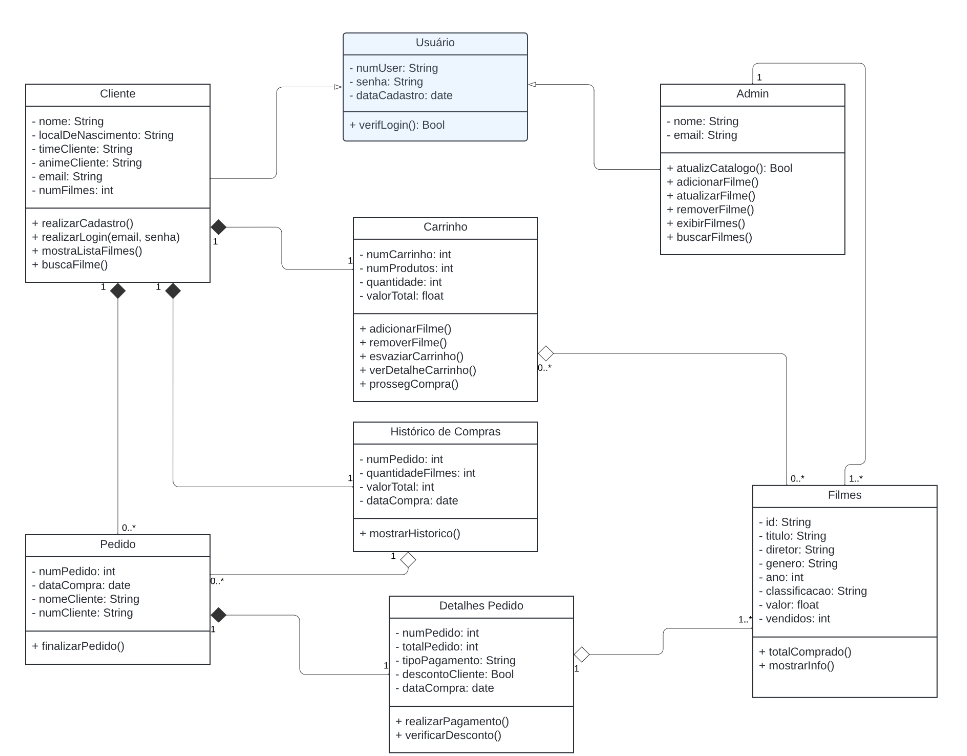

<h1 align="center">  CRUD para aluguel e compra de filmes online  </h1>

<p align="center">
Criar um sistema CRUD para cadastro de estoque/clientes ou realizar vendas relacionado a
um dos temas sugeridos. <br/>
</p>
<p align="center">
  <a href="#-tecnologias">Tecnologias</a>&nbsp;&nbsp;&nbsp;|&nbsp;&nbsp;&nbsp;
  <a href="#-especificações-do-projeto">Especificações do Projeto</a>&nbsp;&nbsp;&nbsp;|&nbsp;&nbsp;&nbsp;
  <a href="#-documentação">Documentação</a>&nbsp;&nbsp;&nbsp;|&nbsp;&nbsp;&nbsp;
  <a href="#-diagrama-uml">Diagrama UML</a>&nbsp;&nbsp;&nbsp;|&nbsp;&nbsp;&nbsp;
  <a href="#-layout">Layout</a>&nbsp;&nbsp;&nbsp;
</p>

## 🚀 Tecnologias

Esse projeto foi desenvolvido com as seguintes tecnologias:

- Python
- MySQL
- Git e Github
- Figma

## 📌 Especificações do projeto

Clique aqui para visualizar o arquivo [link](https://drive.google.com/file/d/1PHZTz1Xi599uEXl4IQVHwf6B_Gc8h3dM/view)

## ✍ Documentação

- **index.py** conecta o CRUD ao banco de dados (mySQL)
```python
import mysql.connector

def conexaoBanco():
    conexao = mysql.connector.connect(
        host ='localhost',
        user ='root', 
        password ='12345', 
        database ='bdfilmes', 
    )
    cursor = conexao.cursor()
    return conexao, cursor

```
- **locadora.py** contém as classes que interagem com o banco de dados MySQL para gerenciar informações sobre filmes disponíveis para empréstimo e venda.

- **importações e conexão com o banco de dados**
```python
import mysql.connector
from index import conexaoBanco

conexao, cursor = conexaoBanco()
```

### Classe locadora
A classe Locadora contém métodos que realizam operações CRUD (Create, Read, Update, Delete) e outras funcionalidades no banco de dados.

```python
#inicializador
class Locadora:
    def __init__(self):
        self.totalFilms = None
```

### Métodos

1. **getTotalFilms** Este método calcula o número total de filmes no banco de dados

```python
def getTotalFilms(self):
    temp = cursor.fetchall()
    self.totalFilms = len(temp)
    print(self.totalFilms)
```
2. **createRow** Insere um novo filme na tabela
```python
def createRow(self, filme, anoFilme):
    nome_filme = filme
    valor_emprestimo = 10
    emprestado = 0
    ano = anoFilme
    quantidade_emprestimo = 0
    comandoCriar = f'INSERT INTO vendas (nomeFilme, valorEmprestimo, emprestado, ano, quantidadeEmprestimo) VALUES ("{nome_filme}", {valor_emprestimo}, {emprestado}, {ano}, {quantidade_emprestimo})'
    cursor.execute(comandoCriar)

    conexao.commit()
```
3. deleteRow
4. readAllRows
5. readColumns
6. readRow
7. updateYear
8. updateValue
9. updateCopies
    


## 📋 Diagrama UML 



## 🖥 Layout

Você pode visualizar o layout do projeto através [DESSE LINK](https://www.figma.com/design/HznRsfDqKCqlzCRFlSAf5i/trabalho-BD?node-id=0-1&t=haPbspjnNqqiHBcw-1). É necessário ter conta no [Figma](https://figma.com) para acessá-lo.
